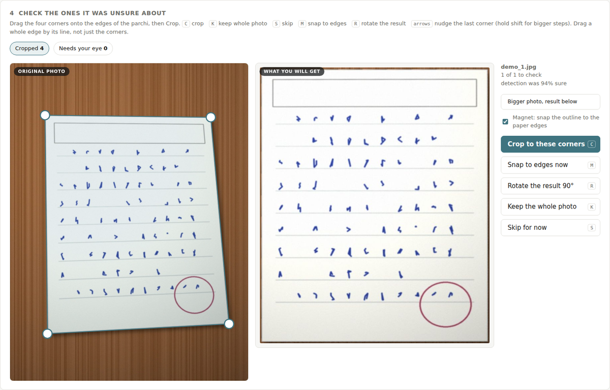
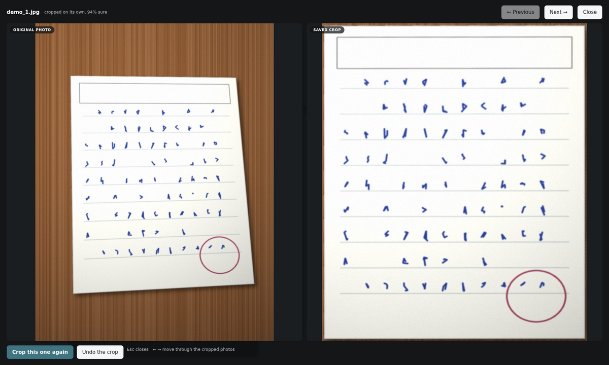

# AutoCrop

Crop and straighten photographed documents, offline, on Windows. No
installation, no internet, no account, nothing uploaded anywhere.

It was built for handwritten bills photographed on phones, but it works on any
photo of a piece of paper: receipts, forms, letters, book pages. If you have
missed having CamScanner on a desktop, this is that, for a folder at a time.



The tool crops what it is confident about and hands you the rest. Dragging four
corners takes a couple of seconds when you can see the result changing beside
the photo, so the photos it cannot do on its own are not a problem, they are a
short queue.



<sub>Both screenshots use a synthetic bill drawn by the test suite. No real
document, from anyone, is included in this repository.</sub>

Nothing is ever deleted or overwritten. Your originals stay exactly as they
are, and everything the tool makes goes into a new `_parchi` folder beside
them.

## Download

Grab the latest zip from [Releases](../../releases), unzip it anywhere, and
double-click `START_Crop.bat`. Windows SmartScreen will warn you that the exe
is unsigned: "More info", then "Run anyway".

## Run from source

```
git clone https://github.com/ccvarun/Autocrop.git
cd Autocrop
python -m venv .venv-build
.venv-build\Scripts\python.exe -m pip install -r requirements.txt
.venv-build\Scripts\python.exe cropui.py
```

Then open `http://127.0.0.1:8112`. `START_Crop_DEV.bat` does the same thing in
one double-click, and serves `web/index.html` straight off the disk so page
edits show on a refresh.

## Build the exe

Double-click `build.bat` on Windows. It makes a build environment, installs
what it needs, runs all three test suites, and refuses to build if any of them
fails. Output lands in `dist\`.

## Tests

```
python selftest.py            # 21 checks on the border trimmer
python parchi_selftest.py     # 34 checks on detection, generates its own photos
python cropui_selftest.py     # 66 checks, drives the real server on a spare port
```

No sample photos are needed. The suites draw their own.

## Working on it

- [ARCHITECTURE.md](ARCHITECTURE.md): how the pieces fit together, the path a
  photo takes, the endpoints, the invariants. Start here.
- [AGENTS.md](AGENTS.md): what has already been tried, measured and rejected.
  Read before changing detection, the audit or the paper mask.

## Licence

MIT, see [LICENSE](LICENSE). The published exe bundles other people's work;
[THIRD-PARTY.md](THIRD-PARTY.md) lists it.

---

## What is in the box

Two portable Windows tools for cropping images offline. Drag files or folders
onto them.

| Tool | Use it for |
| --- | --- |
| `START_Crop.bat` | The everyday one. Opens a page in the browser: pick a folder, run it, then fix by hand the few it was unsure about. |
| `autocrop.exe` | Images with a plain, even border: screenshots, graphics, scans, logos. Trims the border away. |
| `parchi.exe` | The same detection as the page, but as a drag-and-drop batch tool with no review step. |

---

# The Crop page

Double-click `START_Crop.bat`. A browser tab opens at `http://127.0.0.1:8112`.
Double-click `STOP_Crop.bat` when finished.

1. Drag the folder of photos onto the page. If Windows does not hand over the
   folder's location with the drag, the page says so and you click Browse to
   pick it in the usual Windows folder chooser, or paste the path from
   Explorer's address bar. Subfolders are included either way.
2. Press Start. Every photo it is sure about is cropped and straightened
   immediately.
3. If several photos are close-ups, where the parchi fills the whole picture
   and there is nothing to crop, they are grouped together and one button
   clears them all after you have glanced at the thumbnails.
4. It then walks you through the ones it was unsure about, one at a time.
   Drag the four corners onto the edges of the parchi and press Crop, or keep
   the whole photo as it is, or skip it. The panel on the right shows the crop
   you are about to get, updating as you drag, so you are judging the result
   rather than four handles on a busy photo.

The outline is magnetic while you drag. Move a corner near the edge of the
parchi and it sticks to it under your finger, so you place it roughly and it
lands exactly. You can also drag a whole edge by its line rather than moving
two corners, and nudge the last corner you touched with the arrow keys, holding
shift for bigger steps.

While you drag, a magnified circle appears beside the corner so you can see the
paper edge under your own cursor, which is otherwise hidden by your hand and by
the handle itself.

When you let go it does a second, more careful pass that fits a line along each
side and re-cuts the corners where those lines meet. It fits a line along each of
the four sides rather than grabbing the nearest dark pixel, so a fold, a thumb
or a bit of grain cannot drag a side out of place. Turn it off with the Magnet
tick box if a photo is fighting you, and place the corners by hand.

Each photo you finish appears under "Just done" with the crop that was saved
and an Undo button, so you can see the result without stopping, and put a
mistake back in one click. In the grid at the bottom, anything finished shows
the cropped result rather than the original, so the whole folder can be
checked at a glance at the end.

Keyboard while checking: `C` crop, `K` keep the whole photo, `S` skip,
`M` snap to edges.

Finished photos are in `_parchi\1_cropped` inside the folder you chose. Your
original photos are never modified.

Dropping a single photo works too: the page uses the folder it is in.

The review step is the point of the tool. Detection on photos taken by many
different people in many different places will never be perfect, so what
matters is that correcting one takes a few seconds rather than being redone
somewhere else.

They are separate because the two jobs have nothing in common. `autocrop`
trims a known-flat border. `parchi` has to find a sheet of paper in a photo
that could have been taken anywhere, by anyone, at any angle.

---

# parchi.exe

## What it does

Drop a folder of photos on it. Every photo lands in one of three folders,
and nothing is ever lost or overwritten:

```
_parchi\1_cropped         paper found and trusted: straightened and cropped
_parchi\2_review          something found but not trusted: original untouched, see report.csv
_parchi\3_not_detected    original copied through, byte for byte
_parchi\report.csv        one row per photo with its confidence score
_parchi\_debug            the detected outline drawn on each photo, with --debug
```

## Why three folders

These are bills. A crop that slices the total off the bottom of a slip is far
worse than no crop at all. So the tool only crops when it can see a real paper
edge all the way round, and hands everything else to a person.

That means the person checks folders 2 and 3 instead of the whole pile. If
detection lands at 70 percent, they are checking 30 percent of the work.

Do not expect the accuracy of the scanner app on a phone. That app has a
person holding the camera, watching the outline snap to the paper, and moving
until it looks right. That confirmation step is doing most of the work, and a
batch tool running afterwards never gets it.

## Options

| Option | What it does | Default |
| --- | --- | --- |
| `--confidence N` | How sure detection must be before it crops outright. 0 to 100. Lower it and more photos get cropped, but more get cropped wrongly. | 62 |
| `--review N` | Below this the photo goes to 3_not_detected instead of 2_review. | 35 |
| `--margin N` | Percent of extra paper left around a confident crop. | 1 |
| `--enhance` | Lift contrast so faint pen is easier to read. Applies to `1_cropped` only: the other two folders hold untouched originals, and altering them would defeat that. | off |
| `--out DIR` | Where the three folders go. | beside the photos |
| `--debug` | Also write the detected outline drawn on each photo. | off |
| `--audit` | After cropping, check every crop for paper left outside it and name any that look like they cut into the bill. Exits with an error if any did. | off |
| `--no-pause` | Do not wait for a keypress. For scripts. | off |

## Tuning it on real photos

`report.csv` and `--debug` exist for this. Run it on a batch, open the debug
folder, and look at the outlines:

```
parchi.exe photos\ --debug
```

Green is a confident crop, orange went to review, red was not detected. If
good crops are being sent to review, lower `--confidence`. If bad crops are
coming out as confident, raise it. Change one number at a time and re-run on
the same batch, because `report.csv` lets you compare the results directly.

## How detection works

Three independent methods propose candidate outlines: paper edges against the
background, bright low-colour regions that look like paper, and as a last
resort a box around the handwriting. Every candidate is then scored on two
separate things:

1. Shape. Four corners near 90 degrees, opposite sides roughly equal, a
   sensible aspect ratio, filling a real share of the frame.
2. Evidence. Does the outline actually sit on a brightness edge all the way
   round, and is what is inside it brighter or greyer than the ring just
   outside it?

Both halves are needed. Shape alone cannot tell a correct detection from a
wrong one, because the outline of the whole photo is a perfect rectangle too,
and so is a box printed on the bill. The weakest of the four sides counts
double in the evidence score, because three good sides and one guessed side is
exactly how a bill loses its total.

If the paper runs off the edge of the photo, the score is capped so it can
never be a confident crop. Part of the bill is missing, so cropping it would
cut away something real.

## Where it will fail

- White slip on a white desk with no shadow. There is no edge to find.
- A corner or edge outside the frame. Goes to review by design.
- Crumpled or folded slips. There is no straight quadrilateral to find.
- Hard shadow across the paper reading as an edge.

All of these land in review or not-detected rather than producing a bad crop.

---

# autocrop.exe

Trims a uniform border off an image. Drag files or folders on it, cropped
copies appear in a `_cropped` folder next to each source.

Supported: png, jpg, jpeg, webp, bmp, gif, tif, tiff. Animated images are
reported and skipped rather than flattened to one frame.

| Option | What it does | Default |
| --- | --- | --- |
| `--tol N` | How different a pixel must be from the border colour before it counts as content. 0 to 255. | 12 |
| `--pad N` | Leave N pixels of border around the content. | 0 |
| `--out DIR` | Put every crop in one folder. | beside each image |
| `--no-pause` | Do not wait for a keypress. | off |

Raise `--tol` for scans and photographs. Lower it for clean graphics where a
faint edge still matters.

If the image has a transparent border, that is used and nothing else matters.
Otherwise it samples the whole outer edge, takes the most common colour there
as the background, and compares every pixel against it across all three colour
channels independently. It will not trim a gradient background, and it will
not trim an image with a drawn frame, because the frame is content.

---

# Building

Requirements: Windows, Python 3.9 or newer with "Add python.exe to PATH"
ticked at install time.

Double-click `build.bat`. It creates an isolated build environment, installs
the dependencies, runs both self-test suites, and only builds if they pass.
Results are `dist\autocrop.exe` (around 12 MB) and `dist\parchi.exe` (around
60 MB, because it carries OpenCV). Neither needs anything installed on the
machine it runs on.

A one-file exe unpacks itself on each run, so `parchi.exe` takes a few seconds
to start. It then processes the whole folder in one go, so this costs seconds
per batch, not per photo.

## Tests

```
python selftest.py
python parchi_selftest.py [--keep]
```

`selftest.py` covers autocrop: a blue subject that a naive brightness threshold
eats, an EXIF orientation tag that must survive the crop, a palette image with
a transparent border, an animated file, a stray corner pixel, and clean failure
on bad command line options.

`parchi_selftest.py` generates fake photographs of a bill: a slip with ruled
lines and pen marks, perspective-warped onto wood, cloth, newsprint and a white
table, with drop shadow, uneven lighting, blur, noise and JPEG artifacts. It
knows where it put the corners, so it can measure how far off detection was.

Real photos from the centres are the only thing that can establish the true hit
rate. This suite answers the other question, which matters just as much: when
parchi says it is confident, is it actually right? A confident crop with bad
corners is the failure that loses money off a bill, so that is what is
asserted. Detection rate on the hard cases is reported, not asserted.

`--keep` leaves the generated photos and their debug overlays on disk so you
can look at them.

## Files

```
autocrop.py          border trimmer
parchi.py            document detection
selftest.py          tests for autocrop
parchi_selftest.py   tests for parchi, including the fake photo generator
build.bat            one click build of both exes
requirements.txt     Pillow, NumPy, OpenCV
```

# Releasing

Ship `dist\parchi.exe` on its own to the centres, or both exes together.
Nothing else is needed at runtime. Windows SmartScreen warns about an unsigned
executable the first time a fresh copy runs; the user clicks "More info" then
"Run anyway".
